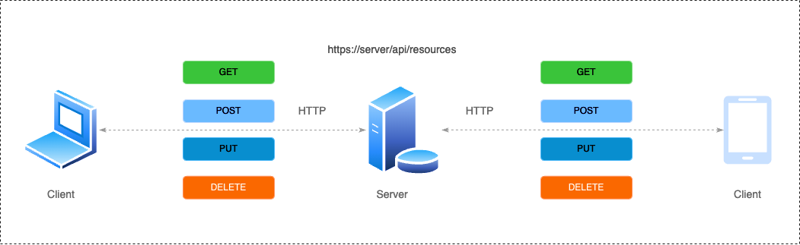

# What is REST API ?

_November 20, 2024_

_Keywords: what are rest apis, rest api testing, rest api definition, what is a rest api, what is api and rest api_

_Read time: 5 minutes_

_Level: intermidiate_

When building and testing modern web applications, REST APIs are foundational tools. Representational State Transfer (REST) has become a dominant architectural style for designing networked applications. This article dives into what REST APIs are, their importance, and considerations for testing, ensuring you can effectively leverage them in your projects.

## What makes API a REST API?

An API, or Application Programming Interface, allows two software applications to communicate with each other. It defines rules and protocols for interaction. A REST API, short for Representational State Transfer API, adheres to REST architectural principles, emphasizing stateless communication and leveraging standard HTTP methods like GET, POST, PUT, and DELETE.

## Key Features

| Feature               | Description |
| --------              | -------     |
| Statelessness         | Each request contains all information needed, with no reliance on server-side state. |
| Client-Server Model   | Separates client concerns (UI, requests) from server concerns (data storage). |
| Cacheable             | Responses are marked as cacheable or non-cacheable to optimize performance. |
| Uniform Interface     | Uses standard HTTP verbs and consistent naming conventions for endpoints. |
| Layered System        | Organizes components into layers, enhancing scalability, modularity, and security through intermediaries like proxies or gateways. |

For example, in a RESTful service, a GET request to https://api.example.com/users might fetch a list of users, while a POST request to the same endpoint would create a new user.

## Definition and Use Cases

The REST API definition emphasizes scalability, simplicity, and flexibility. REST APIs are widely used in scenarios like:

- Microservices: Communication between distributed services.
- Mobile and Web Applications: Data retrieval and user interaction.
- Third-Party Integrations: Connecting external services like payment gateways or social media platforms.

## Benefits
| Benefit               | Explanation |
| --------              | -------     |
| Platform Independence         | Works across multiple programming languages and platforms. |
| Scalability   | Suitable for high-traffic environments. |
| Ease of Testing             | Clear structure simplifies validation of endpoints. |

## REST API Testing
REST API testing ensures that endpoints function correctly and adhere to specified requirements. Testing typically involves verifying the following aspects:

- Functional Testing: Checking if the API meets its functional specifications.
- Performance Testing: Evaluating response times and throughput under load.
- Security Testing: Ensuring sensitive data is protected and endpoints are secure.
- Data Validation: Verifying that data formats (JSON, XML) match the schema.

Common tools for REST API testing include Postman, SoapUI, and automated frameworks like REST-assured for Java. Testers often focus on:

- HTTP Response Codes: Validating codes like 200 (Success), 404 (Not Found), and 500 (Server Error).
- Headers and Payloads: Ensuring they match expected formats and content.
- Authentication: Testing mechanisms like OAuth and API keys.

## The Role in Modern Development?
REST APIs are pivotal for connecting diverse systems in today’s software landscape. They enable modularity and encourage best practices like separation of concerns, making them essential for senior developers designing scalable solutions. Additionally, testers benefit from their predictable structure, allowing more efficient debugging and validation.

To summarize, understanding what REST APIs are, testing their robustness, and recognizing their application is key to building resilient and scalable applications. Adopting tools and methodologies tailored to REST API testing can significantly enhance your development and QA workflows.

By mastering REST APIs, senior developers and testers can ensure their applications meet high standards for usability, reliability, and performance.